# EECS442-Convolutional-Neural-Networks

by Wenzhe Xu

Keywords: CNN, Back Propagation, Classification

## Introduction
In this homework, deep learning neural networks are implemented via Matlab. Two parts in this homeworks are: 1) implementations of CNN building blocks; 2) design and training of a CNN to classify numbers from the MNIST dataset.

## Part I
Tasks are definitions of three types of layers (`fn_linear`,`fn_softmax`,`fn_conv`), one loss function (`loss_crossentropy`), and three helper functions (`inference`, `calc_gradient`, `update_weights`) called by a training algorithm (`train`). Since no discussion on these implementations are required, they are attached in the appendix.

## Part II
The MNIST dataset has handwritten digits for the OCR classification problem. The dataset consists of 28x28 images of handwritten digits from 0 to 9 with their corresponding label. 


The training set is shuffled to form 1000 batches and the batch size is 60 samples. Since the calculation of the loss or accuracy on test set (10,000 samples) is expensive. This calculation interval is selected as 100. In other words, every 100 batches, I calculate over the test set. If the prediction on test set has accuracy over 0.96, stop optimizing the model and save it.

### Architecture
Four architectures based on LeNet-5 are tested and compared. The following figure shows this LeNet-5 CNN architecture. (LeCun, Y., Bottou, L., Bengio, Y., & Haffner, P. (1998). Gradient-based learning applied to document recognition. Proceedings of the IEEE, 86(11), 2278-2324.)


The dimensions of these four architectures (ARCH1-ARCH4) are listed below.

ARCH1: (28x28x1) `conv` (24x24x6) `pool` `relu` (12x12x6) `conv` (8x8x16) `pool` `relu` (4x4x16) `conv` (120) `relu` `flatten` `linear` (84) `linear` (10) `softmax` (10)

ARCH2: (28x28x1) `conv` (24x24x6) `relu` `pool` (12x12x6) `conv` (8x8x16) `relu` `pool` (4x4x16) `conv` (120) `relu` `flatten` `linear` (84) `linear` (10) `softmax` (10)

ARCH3: (28x28x1) `conv` (24x24x6) `pool` `relu` (12x12x6) `conv` (120) `relu` `flatten` `linear` (84) `linear` (10) `softmax` (10)

ARCH4: (28x28x1) `conv` (24x24x6) `pool` `relu` (12x12x6) `conv` (8x8x16) `pool` `relu` (4x4x16) `conv` (2x2x64) `relu` `conv` (120) `relu` `flatten` `linear` (84) `linear` (10) `softmax` (10)

The difference between ARCH1 and ARCH2 is whether `relu` or `pool` follows the `conv` layer. ARCH3 has one conv layer less than ARCH1 and ARCH4 has one conv layer more than ARCH1. In other words, ARCH1, ARCH3 and ARCH4 have different network depth. The cross-entropy losses of the updating model on training set and test set w.r.t the iteration number are given in the following figures.

**ARCH1**


**ARCH2**

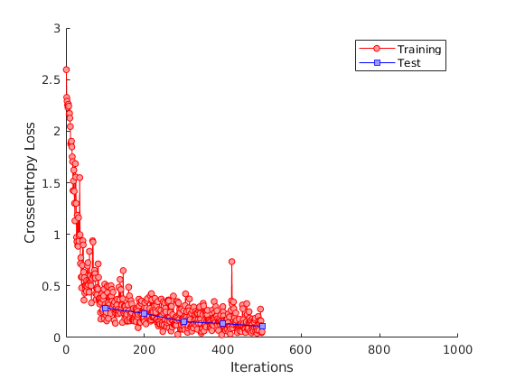

**ARCH3**

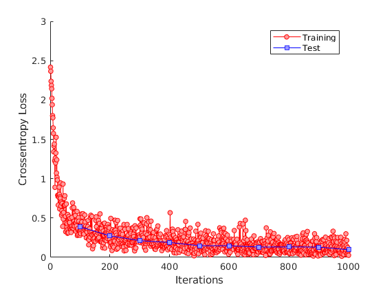

**ARCH4**

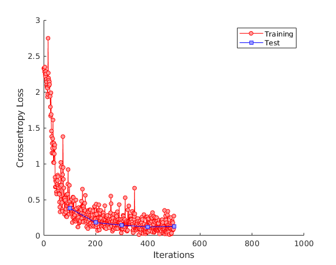

The comparison between these ARCHs are given below.

**Training loss with different ARCHs**

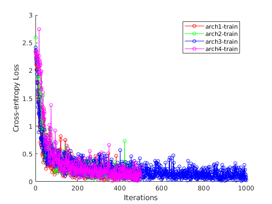

**Test loss with different ARCHs**

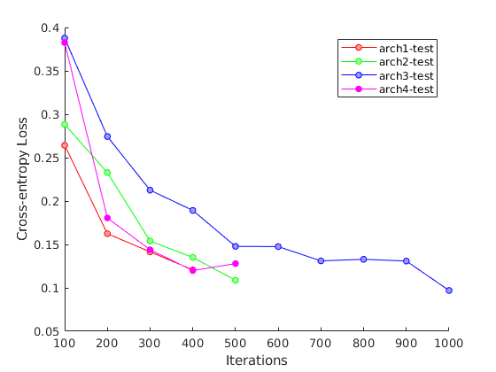

As the figures show, ARCH1 has faster speed of convergence and it achieves 0.96 accuracy with less 400 iterations. Based on the overall performance, ARCH1 is chosen for latter parameter tuning process.


#### ARCH1 hyper-parameters calculations
The input image vector is 28x28. The first CNN layer uses 6 filters and each has a kernel size 5x5. Hence its output has dimension 24x24x6. Why 24? (28-5+1). This output is followed by downsampling layer `pool` and `relu`. The downsampled  output has dimension 12x12x6. Then, a `conv` layer with 16 filters, kernel size 5x5 is added, followed by another `pool` and `relu`, which gives output dimension 4x4x16. Next, a `conv` layer with 120 filters, and each giving one output value (kernel size 4) is added. Finally `relu`,`flatten`, two `linear`, and one `softmax` layers are added to shrink 120 to 10 labels.

### Learning Rate $$\eta$$
#### `learning_rate`
The training algorithms update weights and bias parameters in each iteration to optimize (reduce) the cost. Difference in the learning rate results in different speed of convergence and different stabilities. For example, a very large learning rate $$\eta = 0.5$$ will never train the CNN, as shown below. This large updating step in the parameter space will miss the cost local mimima, giving a oscillating behavior.

**eta = 0.5**

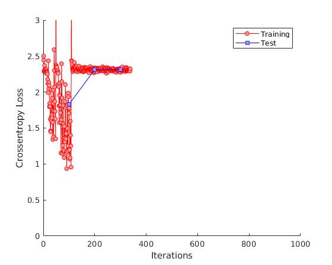

Hence a reasonable range for the learning rate matters. The following learning rates are tested, $$\eta = 0.02, 0.05, 0.1, 0.15, 0.2$$. Again, their convergence behavior w.r.t the iteration number are shown below. 

**eta = 0.02**

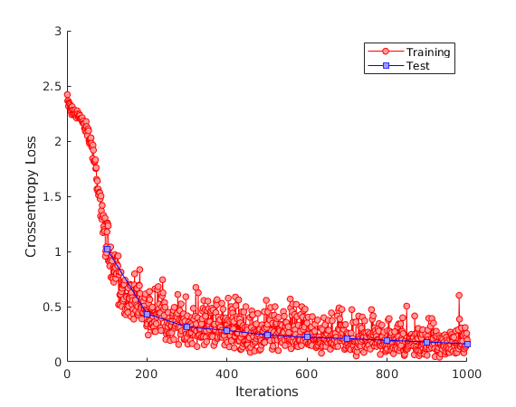

**eta = 0.05**

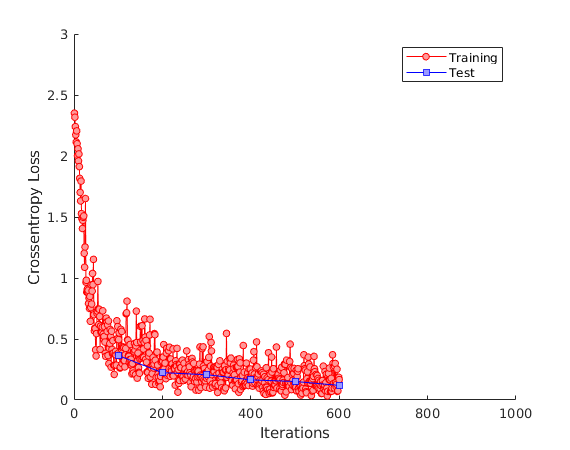

**eta = 0.10**


**eta = 0.15**

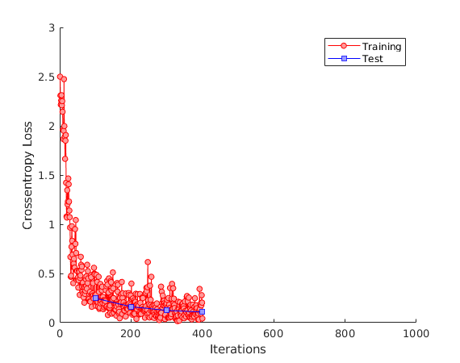

**eta = 0.20**

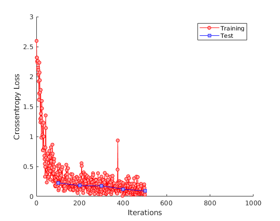

Two plots (training loss / test loss) comparing different learning rates are attached.

**Training loss with different learning rates**

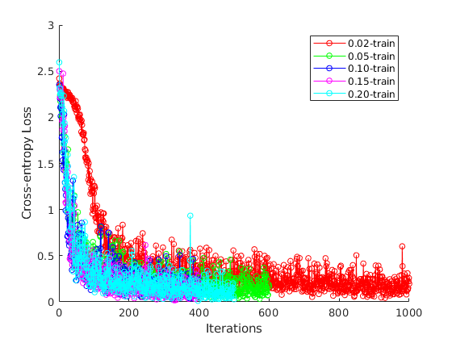

**Test loss with different learning rates**

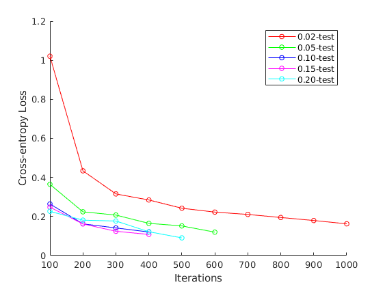

A good learning rate is observed around 0.1-0.15. $$\eta = 0.1$$ is chosen for the later parameter tuning process.

### Weight Decaly `wd`
Weight decay penalizes large weights and effectively limits the freedom in the model. See [this post](https://stats.stackexchange.com/questions/29130/difference-between-neural-net-weight-decay-and-learning-rate) for more details. In this homework, wd = 0.00025, 0.00050, 0.00075, and 0.00100 are tested. The results are shown below.

**wd = 0.00025**

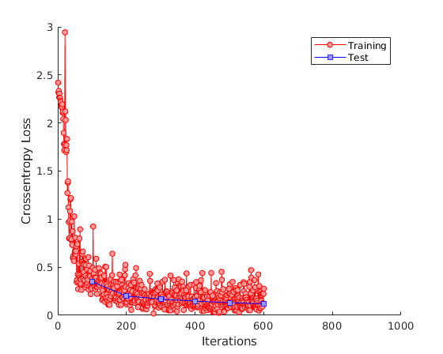

**wd = 0.00050**


**wd = 0.00075**

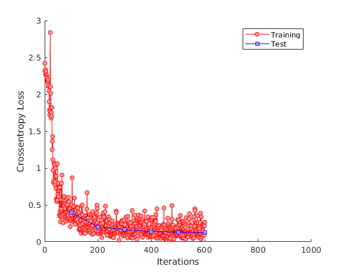

**wd = 0.00100**

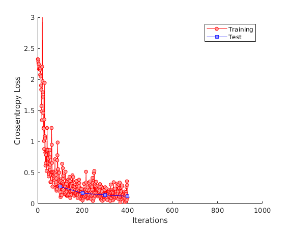

Comparisons among different "wd"s are given for training and test set below.

**Training loss with different weight decays**

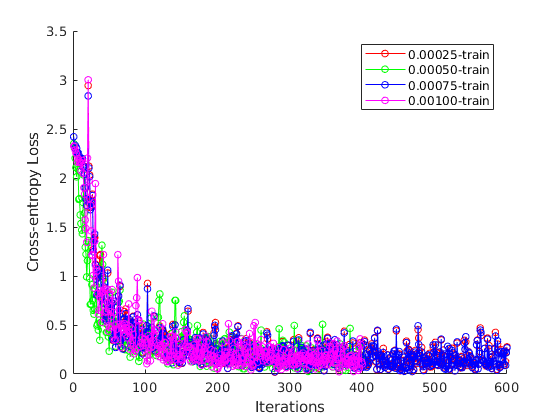

**Test loss with different weight decays**

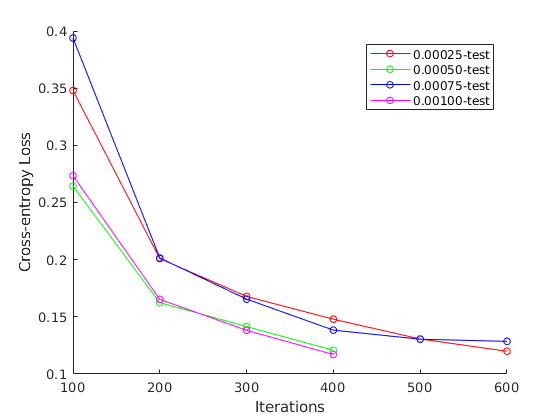

Based on the figures above, weight decay is chosen to be 0.0005.

### Weight and bias initialization
Based on [this discussion](http://cs231n.github.io/neural-networks-2/#init), a initialization scheme on weights based on variances is implemented. However no significant difference was observed.

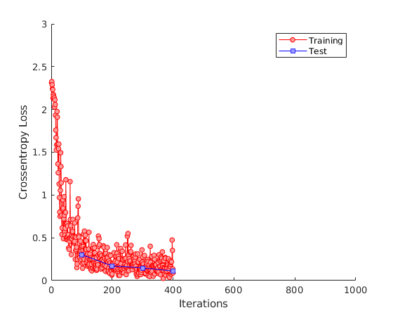

### Momentum $$\alpha$$
Momentum implementation needs to know the weights change ("velocity") in the previous step in order to update the weights for the current step. A combination of both momentum and weight decay tricks is used inspired by [this post](https://stats.stackexchange.com/questions/70101/neural-networks-weight-change-momentum-and-weight-decay). The updating amount is calculated as follows.

$$\Delta W(t+1) = -\eta\frac{\partial L}{\partial W} + \alpha \Delta W(t) - \lambda\eta W$$

where $$\eta$$ is learning rate (0.1), $\lambda$ is weight decay (0.0005). A normal momentum parameter is around 0.8 from our lecture notes. To store the weight updates information, the `update_weights.m` function signiture should be changed.

```matlab
function [updated_model,updated_dweight] = ...
update_weights(model,grad,hyper_params,dweight)
```

The momentum parameter is tested for $$\alpha = 0.7,0.8,0.9$$. The run with $$\alpha = 1.0$$ does not converge. Hence it is omitted. 

**alpha = 0.7**

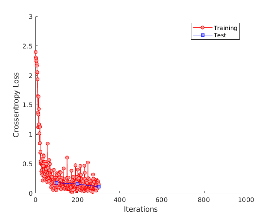

**alpha = 0.8**

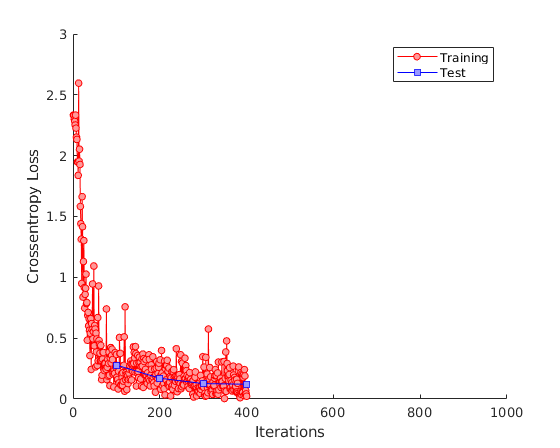

**alpha = 0.9**

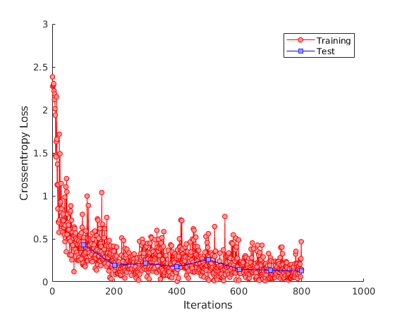

Their performance on the training loss and test loss is evaluated from the following figures.

**Training loss with different momentum**

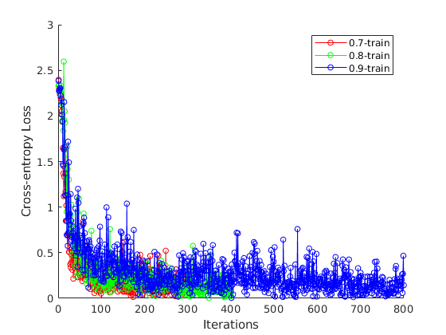

**Test loss with different momentum**

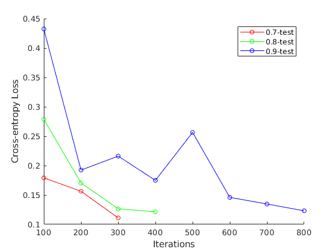

For better convergence speed, momentum is chosen to be $$\leq$$ 0.8.

All comparisons have numerical result tables in the appendix.

Parameter tuning experience is acquired in this homework. Reasonable ranges for learning rate, weight decay, and momentum are given in the analysis above. Though these parameters should be tuned case by case, this homework provides a good start point on hyper-parameters estimation. A simple LeNet-5 CNN can easily classify the handwritten digits with accuracy 0.96, though a more complex NN might improve the accuracy. No overfitting and underfitting is observed in this homework. For future work, a validation data set is needed to account for loss of generalization that various models might have on other test set.


## Appendix Numerical Results (Cross-entropy Loss) Table
```
======== Loss Table =======
iter eta0.1Train eta0.1Test
100	0.265317	0.264244
200	0.239336	0.162414
300	0.0801391	0.141495
400	0.132282	0.120709
===========================
iter eta0.2Train eta0.2Test
100	0.225415	0.226564
200	0.121502	0.181206
300	0.33019	    0.176864
400	0.221865	0.121974
500	0.0277242	0.0905769
===========================
iter eta0.02Train eta0.02Test
100	1.17719	    1.02056
200	0.353379	0.433873
300	0.22107	    0.315604
400	0.335018	0.284531
500	0.22994	    0.242312
600	0.351743	0.222528
700	0.263235	0.21055
800	0.116017	0.194968
900	0.0589659	0.179523
1k  0.196413	0.162493
===========================
iter eta0.05Train eta0.05Test
100	0.383202	0.364784
200	0.351023	0.223983
300	0.177476	0.207394
400	0.184088	0.164901
500	0.109121	0.151863
600	0.166761	0.119833
===========================
iter eta0.15Train eta0.15Test
100	0.191211	0.24799
200	0.185085	0.161983
300	0.200817	0.12436
400	0.0423949	0.108215
===========================
iter RINTTrain RINITest
100	0.400697	0.302553
200	0.0759747	0.170981
300	0.275593	0.147921
400	0.0908481	0.112127
===========================
iter wd0.001Train wd0.001Test
100	0.355794	0.273437
200	0.0513099	0.165246
300	0.262649	0.138191
400	0.101667	0.117007
===========================
iter wd0.00025Train wd0.00025Test
100	0.377288	0.347944
200	0.11336	    0.200924
300	0.212935	0.167844
400	0.18885	    0.147905
500	0.122948	0.130605
600	0.277022	0.119891
===========================
iter wd0.00075Train wd0.00075Test
100	0.394867	0.393886
200	0.107959	0.201474
300	0.220764	0.165482
400	0.168081	0.138362
500	0.123772	0.130413
600	0.266048	0.128549
===========================
iter ARCH2Train ARCH2Test
100	0.323156	0.288358
200	0.153435	0.232795
300	0.260498	0.153963
400	0.299083	0.135064
500	0.0557382	0.108774
===========================
iter ARCH3Train ARCH3Test
100	0.280359	0.387741
200	0.189682	0.274409
300	0.261761	0.212497
400	0.115887	0.189226
500	0.128441	0.1478
600	0.165501	0.147535
700	0.124297	0.131081
800	0.224994	0.132909
900	0.0855123	0.130868
1k	0.0261641	0.0969687
===========================
iter ARCH4Train ARCH4Test
100	0.474793	0.382603
200	0.124918	0.180526
300	0.222878	0.14394
400	0.0770074	0.119942
500	0.271952	0.127954
===========================
iter alpha0.7Train alpha0.7Test
100	0.338734	0.179169
200	0.085492	0.156345
300	0.153392	0.111074
===========================
iter alpha0.8Train alpha0.8Test
100	0.365986	0.278812
200	0.178773	0.170505
300	0.125558	0.126508
400	0.0228996	0.121475
===========================
iter alpha0.9Train alpha0.9Test
100	0.469489	0.432355
200	0.290548	0.192398
300	0.254842	0.216129
400	0.194761	0.174893
500	0.301099	0.256464
600	0.113346	0.145965
700	0.279525	0.134669
800	0.143178	0.123107
```